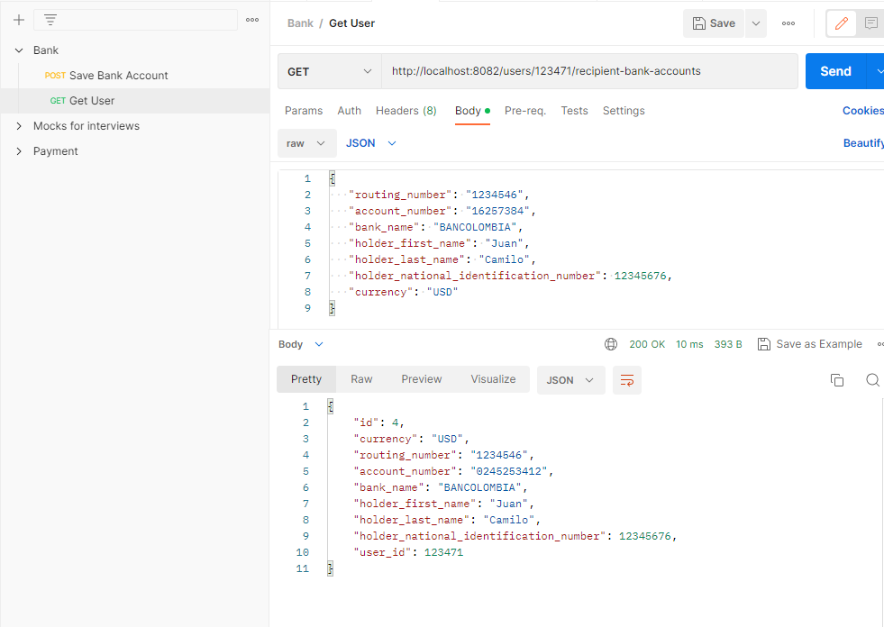
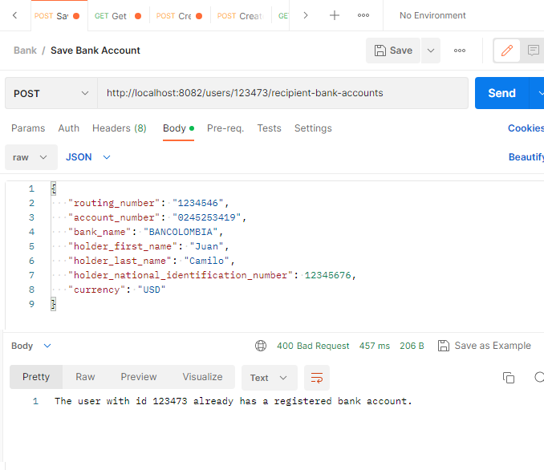

# Bank Challenge

## How to run it

```bash
# Locally
$ ./gradlew bootRun

```

`bank_api.postman_collection.json` to import use case
examples.

## Diagrams

### Architecture


### Postgres Diagram


### Dbeaver diagram


# Scheduler

this scheduler will be running periodically and will also generate random status for transactions processing, then
it will change the status in database according its final status 


### Random Status


### Swagger Integration

`http://localhost:8082/swagger-ui/index.html` to see


## Examples

### Successful Creation Recipient Bank Account


### Get User Recipient Bank Account



### Success Payment Transaction


### Successful Get Payments


### Errors




